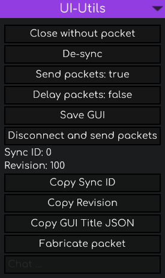
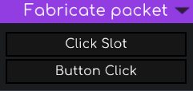
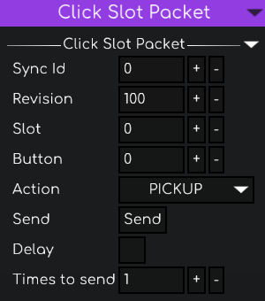
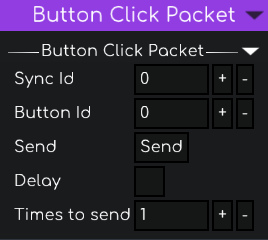

# UI-Utils Meteor Addon
Meteor Client addon that brings UI-Utils style GUI debugging and control tools.

## Requirements
- Minecraft (Fabric) + Fabric API
- Meteor Client (addon loaded)

## How to use
- Enable the `ui-utils` module in Meteor.
- Open any inventory or container. A set of buttons and a text field will appear on top of the GUI.
- Works on inventories/containers and lectern screens.

  

## Features
- **Close without packet**: closes the GUI without sending `CloseHandledScreenC2SPacket` to the server.
- **De-sync**: closes the GUI server-side while keeping it open client-side.
- **Send packets: true/false**: allows or blocks `ClickSlotC2SPacket` and `ButtonClickC2SPacket`.
- **Delay packets: true/false**: queues click packets and sends them all at once when disabled.
- **Save GUI**: stores the current GUI for later restoration.
- **Disconnect and send packets**: flushes queued packets and disconnects the client.
- **Sync ID** and **Revision**: shows internal sync values.
- **Copy Sync ID / Copy Revision**: copies values to clipboard.
- **Copy GUI Title JSON**: copies the GUI title in JSON format.
- **Fabricate packet**: build and send `ClickSlotC2SPacket` or `ButtonClickC2SPacket`.
- **Chat box**: type chat or run commands without closing the GUI.

## Restore saved GUI
After using **Save GUI**, you can restore it while no screen is open:
- Default key: `V`

## Quick tutorial: Fabricate packet
`ClickSlotC2SPacket` and `ButtonClickC2SPacket` are the two packet types this addon can craft.

When clicking **Fabricate packet** you should see this window:

  

### Click Slot Packet

  

  <ol style="display: inline-block; text-align: left; max-width: 540px;">
    <li>Open <strong>Fabricate packet</strong> -> <strong>Click Slot</strong>.</li>
    <li>Fill <code>Sync Id</code> and <code>Revision</code> with the values shown in the GUI.</li>
    <li>Set <code>Slot</code>, <code>Button</code>, and <code>Action</code>.</li>
    <li>Optional: enable <strong>Delay</strong> and adjust <strong>Times to send</strong>.</li>
    <li>Click <strong>Send</strong>.</li>
  </ol>

### Button Click Packet

  

  <ol style="display: inline-block; text-align: left; max-width: 540px;">
    <li>Open <strong>Fabricate packet</strong> -> <strong>Button Click</strong>.</li>
    <li>Fill <code>Sync Id</code> with the value shown in the GUI.</li>
    <li>Set <code>Button Id</code>.</li>
    <li>Optional: enable <strong>Delay</strong> and adjust <strong>Times to send</strong>.</li>
    <li>Click <strong>Send</strong>.</li>
  </ol>

